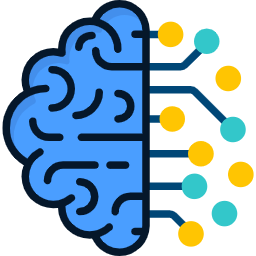

<div align="center">
  
  
  # 🔵 CrawlMind
  
  **Professional AI Powered Document Analysis & Intelligence Platform**
  
  
  
  
  
  
</div>

---

A modern, professional AI-powered document analysis and chat application built with Streamlit and Google Gemini. CrawlMind allows you to crawl web content, upload documents, and interact with your data using advanced RAG (Retrieval Augmented Generation) technology.

## ✨ Features

- **🌐 Advanced Web Crawling**: Deep content extraction with JavaScript execution and CSS selectors
- **📁 Document Upload**: Support for PDF and TXT files with intelligent processing
- **🤖 Modern Chat Interface**: Clean, minimal AI chat interface inspired by AI Studio
- **🔍 RAG Technology**: Advanced retrieval-augmented generation using ChromaDB and LangChain
- **🎨 Professional UI**: Modern blue/dark themed interface with centered design
- **🔗 Social Integration**: GitHub and LinkedIn buttons for professional networking
- **⚡ Real-time Processing**: Instant document embedding and retrieval with Google Gemini
- **🛡️ Secure API Management**: Protected API key handling with validation

## 🛠️ Tech Stack

- **Frontend**: Streamlit with custom CSS styling
- **AI/ML**: Google Gemini API, LangChain
- **Vector Database**: ChromaDB with persistent storage
- **Document Processing**: PyPDF, TextLoader
- **Web Crawling**: Enhanced crawler with crawl4ai
- **Embeddings**: Google Generative AI Embeddings (models/embedding-001)
- **LLM**: Google Gemini (gemini-1.5-flash)

## 📋 Prerequisites

Before running CrawlMind, ensure you have:

1. **Python 3.8+** installed
2. **Google Gemini API Key** (get from Google AI Studio)
3. **Internet connection** for API access

### Getting a Gemini API Key

1. Visit [Google AI Studio](https://makersuite.google.com/app/apikey)
2. Create a new API key
3. Copy the key for use in the application
## 🚀 Installation

1. **Clone the repository**
   ```bash
   git clone https://github.com/Kaustub-Mocherla/crawlmind.git
   cd crawlmind
   ```

2. **Create virtual environment**
   ```bash
   python -m venv app
   ```

3. **Activate virtual environment**
   ```bash
   # Windows
   app\Scripts\activate
   
   # macOS/Linux
   source app/bin/activate
   ```

4. **Install dependencies**
   ```bash
   pip install -r requirements.txt
   ```

5. **Run the application**
   ```bash
   streamlit run app.py
   ```

6. **Configure API Key**
   - Enter your Gemini API key in the sidebar
   - The app will validate and configure the API connection

## 📦 Dependencies

```txt
streamlit
validators
chromadb
langchain-chroma
langchain-google-genai
langchain-core
langchain-community
pypdf
google-generativeai
protobuf==3.20.3
```

## 🎮 Usage

### 1. Start the Application
Navigate to `http://localhost:8501` after running the Streamlit command.

### 2. Configure API Key
- Enter your Google Gemini API key in the sidebar
- Look for the green "✅ API Key configured!" message

### 3. Add Content
- **URL**: Enter a single URL to crawl web content with advanced options
- **Documents**: Upload PDF or TXT files for analysis

### 4. Process Documents
Click "� Crawl & Embed" to process your content and create embeddings.

### 5. Chat with Your Data
Use the centered chat interface to ask questions about your documents.

## 📁 Project Structure

```
CrawlMind/
├── app.py                  # Main Streamlit application
├── crawler.py              # Enhanced web crawling functionality
├── styles.css              # Professional UI styling
├── requirements.txt        # Python dependencies
├── artificial-intelligence.png  # App logo
├── crawled_content.md      # Temporary crawled content
├── crawlmind_db/          # ChromaDB storage
└── app/                   # Virtual environment
```

## 🔧 Configuration

### Gemini API Settings
- **Model**: `gemini-1.5-flash`
- **Embedding Model**: `models/embedding-001`
- **Temperature**: `0.3`
- **API Endpoint**: Google Generative AI

### ChromaDB Settings
- **Storage Path**: `./crawlmind_db`
- **Collection Name**: `crawlmind_collection`
- **Persistence**: Enabled

### Crawler Settings
- **JavaScript Execution**: Enabled
- **CSS Selectors**: Custom targeting
- **Media Extraction**: Supported
- **Delay Configuration**: Optimized

## 🎨 UI Theme

CrawlMind features a sleek blue and dark theme:
- **Background**: Deep black (#0a0a0a)
- **Sidebar**: Dark gray (#1a1a1a)
- **Accent**: Professional blue (#4A9EFF)
- **Typography**: Clean, modern fonts with centered layout

## 🤝 Contributing

1. Fork the repository
2. Create your feature branch (`git checkout -b feature/AmazingFeature`)
3. Commit your changes (`git commit -m 'Add some AmazingFeature'`)
4. Push to the branch (`git push origin feature/AmazingFeature`)
5. Open a Pull Request

## 📝 License

This project is licensed under the MIT License - see the [LICENSE](LICENSE) file for details.

## 🐛 Known Issues

- Ensure valid Gemini API key is entered before processing
- Large documents may take time to process
- UTF-8 encoding is required for web content with special characters
- Protobuf version compatibility with ChromaDB (fixed with protobuf==3.20.3)

## 🚀 Roadmap

- [ ] Support for more document formats (DOCX, HTML)
- [ ] Multiple LLM provider support
- [ ] Advanced search and filtering
- [ ] Document summarization features
- [ ] Export chat conversations
- [ ] User authentication and sessions
- [ ] Batch document processing
- [ ] Enhanced web crawler with more options

## 📞 Support

If you encounter any issues or have questions:

1. Check the [Issues](https://github.com/Kaustub-Mocherla/crawlmind/issues) page
2. Create a new issue with detailed description
3. Include error logs and system information

## ⭐ Acknowledgments

- [Streamlit](https://streamlit.io/) - For the amazing web framework
- [Google Gemini](https://ai.google.dev/) - For powerful AI capabilities
- [LangChain](https://langchain.com/) - For RAG implementation
- [ChromaDB](https://www.trychroma.com/) - For vector storage

---

Made with ❤️ by [Kaustub Mocherla](https://github.com/Kaustub-Mocherla)
